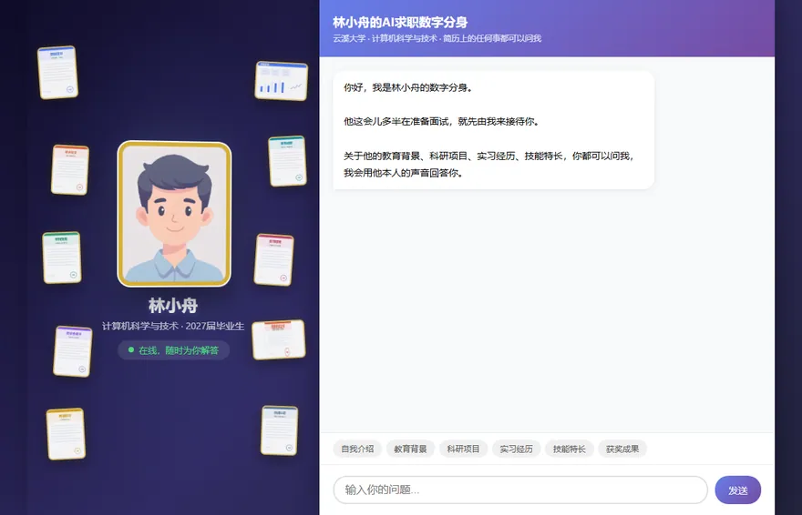

# AI 求职数字分身

> 让 HR 打开一个链接，就能跟一个"用你本人声音说话的 AI 分身"聊天 —— 比起翻一页纸的简历，他能在 3 分钟里真正记住你。

一个可以自己跑起来的轻量项目：网页上是一个数字人形象，访客用文字提问，它用**你本人的音色**回答，
回答的文字会**跟着声音一个字一个字点亮**；页面两侧散落着证书、论文、专利卡片，点一下能看高清大图。

项目由一位正在求职的应届生用对话式 AI 完成（**代码全部由 AI 生成**，作者负责把需求讲清楚、定验收标准、
用实测数据判断对错），现在把完整代码开源出来，**附两条保姆级教程**：一条是把提示词直接丢给 AI 让它帮你做，
一条是你自己一步步做。



> **关于演示**：动图录自本项目真实运行的界面，10 秒完整流程（提问 → 回答出现 → 文字跟读点亮）。
> 其中的**人物形象、学校、单位、证书全部是虚构示例**，不对应任何真实的人。
> 需要带配音的完整视频可以下载 [`docs/demo.mp4`](docs/demo.mp4)（约 10 秒，3.8MB）。

---

## 目录

- [它有哪些功能](#它有哪些功能)
- [你需要准备什么](#你需要准备什么)
- [教程一：把提示词丢给 AI，让它帮你部署](#教程一把提示词丢给-ai让它帮你部署)
- [教程二：自己动手部署（想搞懂每一步就看这条）](#教程二自己动手部署想搞懂每一步就看这条)
- [怎么改成你自己的](#怎么改成你自己的)
- [常见问题（都是真实踩过的坑）](#常见问题都是真实踩过的坑)
- [项目结构](#项目结构)
- [安全须知](#安全须知)

---

## 它有哪些功能

| 功能 | 说明 |
| --- | --- |
| 文字问答 | 访客用文字提问，AI 根据你提供的资料回答，不编造，不知道就说不知道 |
| 本人音色朗读 | 提前用"声音复刻"训练出你自己的音色，回答时自动用你的声音念出来 |
| 文字跟读高亮 | 声音播到哪个字，哪几个字就点亮，看得见也听得见 |
| 卡片墙 | 头像两侧散落证书 / 论文 / 专利缩略图（默认 10 张），点开看高清大图 |
| 手机电脑通用 | 一个链接，手机、电脑、微信里打开都正常，页面上不会出现"点我播放"的按钮 |
| 快捷提问 | 页面底部有"自我介绍 / 教育背景 / 科研项目"等按钮，访客点一下就问 |
| 自动保持在线 | 免费云平台闲置 15 分钟会休眠，方案里包含保活配置，让链接随时打得开 |

---

## 你需要准备什么

一共要申请 **3 个东西**，全部有免费额度，加起来大约 20 分钟。

### 1. 一个 GitHub 账号（免费）

用来存放代码。注册地址：https://github.com/signup

### 2. 一个 Render 账号（免费）

用来把代码变成可以访问的网址。注册时选 **GitHub 登录**最省事：https://dashboard.render.com/register

### 3. 豆包（火山方舟）的 2 个 Key

这是 AI 的"大脑"和"嘴巴"。

**（1）聊天用的 API Key**

1. 打开火山方舟控制台 https://console.volcengine.com/ark
2. 左侧找到「API Key 管理」→ 创建一个 API Key，复制保存（形如 `ark-xxxxxxxx-....`）
3. 左侧找到「开通管理」，把要用的对话模型开通（本项目的默认模型是 `doubao-seed-1-6-251015`，
   你也可以换成别的，只要把模型 ID 填对）

**（2）声音复刻的 Key 和 Speaker ID**

1. 在同一个控制台，找到「语音技术」→「声音复刻」（大模型复刻，2.0）
2. 上传一段你自己的清晰录音（建议 10~30 秒，安静环境、不要有背景音乐），训练出你的音色
3. 训练完成后会得到一个 **Speaker ID**（形如 `S_xxxxxxxxx`），复制保存
4. 同时记下语音服务的 **API Key**（一串 UUID 形式）

> 没有声音复刻也能跑：项目会自动退回到系统默认音色，只是听起来不是你本人。

---

## 教程一：把提示词丢给 AI，让它帮你部署

如果你不想自己一步步操作，**把下面整段提示词复制**，发给任何能操作你电脑的 AI 助手
（比如 WorkBuddy、Cursor、豆包等），它就会带着你完成部署。

> 使用前请把方括号里的内容替换成你自己的情况。**不要把 API Key 写在提示词里** ——
> 让 AI 每到一个需要填 Key 的步骤就停下来，你自己去网页上填。

```text
你是一位很耐心的部署工程师，请帮我把下面这个开源项目部署到线上。
我对技术细节不熟，请你用大白话解释每一步在做什么，并且每完成一步都明确告诉我
"现在轮到我做什么"，我做完回复你之后再继续下一步。

【项目信息】
项目名称：AI 求职数字分身（网页上和 AI 分身聊天，用我本人的声音回答）
代码位置：【填写路径，例如：我已经解压到 C:\Users\我的名字\Desktop\ai-job-avatar】
项目结构：
  - server.py         后台程序（聊天接口 + 语音合成 + 提供网页）
  - static/index.html 网页界面
  - requirements.txt  依赖清单
  - Procfile          云平台启动命令
  - config.env.example 配置模板
启动命令：gunicorn server:app --bind 0.0.0.0:$PORT --workers 1 --timeout 120

【最终目标】
把它变成一个公网网址，我发在简历里；别人用手机或电脑点开就能跟我聊天、听到我的声音；
我的电脑关机之后它照样能用。

【我已经准备好的东西】
- GitHub 账号（已登录）
- Render 账号（已用 GitHub 登录）
- 豆包方舟聊天 API Key（我有，但我要自己填，不要让我发给你）
- 豆包语音复刻 API Key 和 Speaker ID（我有，我自己填）
- 我的声音已经训练完了，Speaker ID 是 S_ 开头的字符串

【请按下面的顺序执行，每步验证通过再进行下一步】

第 1 步 检查环境
  检查我的电脑有没有 Python 3.10 以上版本。没有就告诉我从哪里下载、安装时要注意什么
  （提醒我勾选 Add Python to PATH）。

第 2 步 安装依赖
  在项目目录执行 pip install -r requirements.txt。如果下载慢，换清华镜像源。

第 3 步 配置密钥（这一条最重要，请严格遵守）
  帮我把 config.env.example 复制成 config.env，然后把这 5 个配置项的名字列给我，
  让我自己去填值：
    DOUBAO_API_KEY / DOUBAO_MODEL / TTS_API_KEY / TTS_SPEAKER_ID / TTS_RESOURCE_ID
  并且告诉我：这个文件已经被 .gitignore 排除了，不会被上传。
  不要要求我把 Key 发到对话里，也不要替我把 Key 写进文件。

第 4 步 本地启动并自检
  启动 server.py，然后访问 http://127.0.0.1:5000/api/health，确认返回里
  tts_engine 是 doubao_clone、audio_dir_writable 是 true。
  如果有问题，按这两条排查：
    - tts_engine 是 edge_tts_fallback → 音色相关的 Key 或 Speaker ID 没配好
    - audio_dir_writable 是 false → 语音目录建不出来
  排查时请先看启动时的命令行报错，再对照上面两条，不要让我盲目重试。

第 5 步 本地功能验收
  在浏览器打开首页，点一个快捷问题，确认三件事：
  ① 文字回答正常出现；② 有声音，而且是我的音色；③ 文字会跟着声音逐个高亮。
  然后确认手机上也一样，且页面上没有播放按钮。

第 6 步 上传到 GitHub
  指导我新建一个仓库并上传代码。上传前你必须逐项检查：
    - 绝对没有 config.env
    - 绝对没有任何以 sk- / ark- / S_ 开头或 UUID 形式的密钥字符串
    - audio 目录要上传（里面要有 .gitkeep 占位文件）
  检查完之后把"我确认没有密钥"这句话明确告诉我。

第 7 步 部署到 Render
  一步步指导我：New + → Web Service → 选仓库 → Python 3 →
  Build Command 填 pip install -r requirements.txt →
  Start Command 用上面那行 gunicorn → Instance Type 选 Free。

第 8 步 配置环境变量
  把要添加的 5 个变量名和它们的作用列成表格给我，值我自己在网页上填。
  填完点 Create Web Service。

第 9 步 线上验收
  部署完成后访问 https://我的网址/api/health，确认和本地一致；再打开首页确认有声音。
  注意：Render 显示部署成功之后，新版有时候还要再等 20~30 秒才真正生效，
  如果第一次测不对，请等一等再测一次，不要急着改代码。

第 10 步 让链接随时打得开
  指导我注册 UptimeRobot（免费），添加一个 HTTP(s) 监控：
  地址填 我的网址/api/health，间隔 5 分钟。
  并解释为什么：Render 免费实例闲置 15 分钟会休眠，别人首次打开要等约 50 秒。

第 11 步 交付说明
  最后给我一份简单的说明，告诉我以后怎么改内容：
    - 改"分身说什么"：编辑 server.py 里 system_prompt 那一段文字
    - 改头像：替换 static/assets/th/avatar.webp（大图同名放 lg 目录）
    - 改卡片图片：替换 static/assets/th 与 lg 下的图片，并按需改 index.html 里的引用
    - 改完怎么发布：把文件重新上传到 GitHub，然后在 Render 点
      Manual Deploy → Deploy latest commit

【总体要求】
1. 任何时候都不要让 API Key 出现在聊天记录、代码文件或提交记录里。
2. 不要一次性把 11 步都讲给我，一步一步来，我确认完成了再进行下一步。
3. 报错时先让我把完整报错信息发给你，你判断原因；不要让我反复重试同一个操作。
4. 涉及"删除文件""重置配置"这类不可逆操作前，先告诉我影响，等我同意。
```

这份提示词的单独副本也在 [`docs/one-click-deploy-prompt.md`](docs/one-click-deploy-prompt.md)。

---

## 教程二：自己动手部署（想搞懂每一步就看这条）

### 第 1 步：把代码下载到电脑

在本页右上角点绿色按钮 **Code → Download ZIP**，解压到一个你能找到的文件夹（比如桌面）。

解压后你会看到这些内容：

```
server.py            后台程序
requirements.txt     需要安装的库
Procfile             云平台的启动命令
config.env.example   配置文件模板
static/              网页文件（界面 + 图片）
audio/               存放语音缓存（目录要保留）
```

### 第 2 步：先在本地跑通（重要，别跳过）

这一步是为了先在自己电脑上确认没问题，再去云上折腾。

**2.1 安装 Python**

去 https://www.python.org/downloads/ 下载安装 Python 3.10 以上版本。
安装时**一定要勾选** "Add Python to PATH"。

**2.2 安装依赖**

打开命令行（Windows 按 `Win + R`，输入 `cmd` 回车），依次执行：

```bash
cd 你解压出来的项目文件夹路径
pip install -r requirements.txt
```

如果下载很慢，加一个国内镜像：

```bash
pip install -r requirements.txt -i https://pypi.tuna.tsinghua.edu.cn/simple
```

**2.3 填上你自己的 Key**

把 `config.env.example` 复制一份、改名为 `config.env`（**必须叫这个名字**），
用记事本打开，填上刚才申请到的值：

```ini
DOUBAO_API_KEY=你的方舟APIKey
DOUBAO_MODEL=doubao-seed-1-6-251015
TTS_API_KEY=你的语音APIKey
TTS_SPEAKER_ID=你的SpeakerID
TTS_RESOURCE_ID=seed-icl-2.0
```

> `config.env` 已经在忽略清单里，**不会被上传到 GitHub**，可以放心填。

**2.4 启动**

```bash
python server.py
```

看到类似 `Running on http://127.0.0.1:5000` 就成功了。浏览器打开 http://127.0.0.1:5000
点一个快捷问题试试 —— 应该能看到文字冒出来，并且有声音。

**这一步的常见情况**

- 没声音：先检查 `TTS_SPEAKER_ID` 有没有填对；再看命令行有没有报错信息
- 聊天报错：检查 `DOUBAO_API_KEY` 和模型 ID

### 第 3 步：把代码上传到你的 GitHub

1. 登录 GitHub，右上角 **+ → New repository**
2. 仓库名随便起，选 **Public**，点 **Create repository**
3. 在新仓库页面点 **uploading an existing file**
4. 把项目文件拖进去。**注意两点**：
   - `config.env`（装 Key 的那个）**千万不要上传**
   - `audio` 文件夹要一起上传（里面有个 `.gitkeep` 占位文件，它保证这个文件夹在云端也存在）
5. 下面的提交信息随便写，点 **Commit changes**

> 如果拖拽不方便，用 GitHub Desktop 客户端也行，记得同样排除 `config.env`。

### 第 4 步：部署到 Render

1. 打开 https://dashboard.render.com/ ，用 GitHub 登录
2. 点 **New +** → **Web Service**
3. 选择你刚才创建的仓库（第一次用需要先授权 Render 访问你的 GitHub）
4. 关键设置：
   - **Name**：随便起，这个名字会变成你的网址前缀
   - **Language / Runtime**：选 `Python 3`
   - **Build Command**：`pip install -r requirements.txt`
   - **Start Command**：（一般会自动读取 Procfile，如果让你手填就填下面这行）
     ```
     gunicorn server:app --bind 0.0.0.0:$PORT --workers 1 --timeout 120
     ```
   - **Instance Type**：选 **Free**（免费）
5. 先别急着点创建，找到 **Environment Variables**（环境变量）

### 第 5 步：填环境变量（最容易出错的一步）

在 Environment Variables 区域，一条条添加（Key 和 Value 分别填）：

| Key | Value |
| --- | --- |
| `DOUBAO_API_KEY` | 你的方舟 API Key |
| `DOUBAO_MODEL` | `doubao-seed-1-6-251015` |
| `TTS_API_KEY` | 你的语音 API Key |
| `TTS_SPEAKER_ID` | 你的 Speaker ID |
| `TTS_RESOURCE_ID` | `seed-icl-2.0` |

填完点 **Create Web Service**，等着它构建（第一次大约 2~3 分钟）。

> Render 也支持「Add from .env」：把 `config.env` 的内容整段粘进去，一次性创建所有变量，更快。

### 第 6 步：验证是否成功

构建完成后，Render 会给你一个网址（形如 `https://xxxx.onrender.com`）。

1. **先测健康检查**：浏览器打开 `你的网址/api/health`，应该看到一段 JSON：
   ```json
   {"status":"ok","tts_engine":"doubao_clone","audio_dir_writable":true}
   ```
   - 看到 `"tts_engine": "doubao_clone"` → 你的音色配置成功
   - 看到 `"tts_engine": "edge_tts_fallback"` → 音色 Key 没配好，回去检查环境变量
   - 看到 `"audio_dir_writable": false` → 语音目录有问题

2. **再打开首页**，点一个快捷问题，确认有声音、文字会跟着亮。

### 第 7 步：让链接"随时打得开"（推荐做）

免费版云平台有个特点：**15 分钟没人访问就会自动休眠**，访客点开要等 50 秒左右才能看到页面。

解决办法是找一个"定时访问"的服务帮你一直戳它，本项目的做法是：

1. 注册 https://uptimerobot.com （免费，用 GitHub 登录最快）
2. 添加一个监控：类型选 `HTTP(s)`，地址填 `你的网址/api/health`，间隔选 5 分钟
3. 保存即可

项目里还带了一份备用方案（`.github/workflows/keepalive.yml`）：它利用 GitHub 自带的定时任务
去访问你的网址。用法是把它放在仓库的 `.github/workflows/` 目录下，并**把里面的网址改成你自己的**。

> 实话实说：GitHub 的定时任务不太守时（实测可能延迟 2~4 小时），所以它只适合当备胎，
> 主力还是上面那个专门的监控服务。

---

## 怎么改成你自己的

### 1. 改"人设资料"（最重要）

你分身说的每一句话，依据都是 `server.py` 里的 `system_prompt`（搜索 `system_prompt` 就能找到）。
它现在是一份**虚构的示例资料**，格式如下：

```text
你是XX的数字分身，基于真实简历信息回答问题。第一人称，口语化...

## 基本信息
姓名、电话、邮箱、毕业时间、学校专业

## 教育背景
……

## 科研项目
……

## 实习经历
……

## 获奖成果
……

## 技能特长
……

## 求职意向
……
```

**把里面的内容换成你自己的真实信息就行**，格式可以照抄。四条经验：

1. **写得更细，回答就更准**。但同一件事尽量一句话说完，太长的句子它容易只挑半句讲。
2. **不确定的事宁可不写**。程序里定了一条规则："资料里没有的就说不知道"，所以删掉比写错安全。
3. **控制回答长度**。示例里写了"默认 1-2 句话、40 字以内"——这个限制很有用：
   回答太长，朗读要等很久，访客没耐心看完。
4. **不想让它主动提的事，就明确写一条规则**。例如：
   ```text
   【重要】主动介绍时不要提"专科""专升本"这类字眼。只有对方明确追问时，才如实说明。
   ```
   这种"只在被问时才说"的写法非常好用。

改完之后，把 `server.py` 重新上传到 GitHub（覆盖原文件），
再到 Render 里点 **Manual Deploy → Deploy latest commit**，等 1~2 分钟即可生效。

### 2. 换头像和卡片图片

- 头像：替换 `static/assets/th/avatar.webp`（点开看的大图放 `static/assets/lg/avatar.webp`）
- 卡片：替换 `static/assets/th/` 与 `static/assets/lg/` 下的图片
  （两套分别是缩略图和大图，文件名要一致），如需增删张数就改 `static/index.html` 里
  `` 那几行

页面为了加载快，用了"缩略图 + 大图"两套图。如果你嫌麻烦，直接引用原图也能跑，只是首次打开会慢一些。

> 图片体积很关键：本项目优化前首屏要下 7.17MB，压缩后只有 294KB。
> 建议每张图压到 400px 宽左右（缩略图）和 1200px 宽（大图）。

### 3. 改首页问候语

在 `static/index.html` 里搜索"你好，我是"，把那段改成你自己的开场白。
开场白建议：一句自我介绍 + 一句引导（告诉对方可以问什么），不要写技术说明。

---

## 常见问题（都是真实踩过的坑）

**Q1：部署到线上后聊天正常，但没有声音**

最常见的原因是**语音文件目录在云端不存在**。这个项目已经修好了，但如果你是参考别的代码
自己改的，请检查两点：

1. `.gitignore` 里不要写 `audio/`（这会把整个目录排除；要写成 `audio/*` 再加一行 `!audio/.gitkeep`）
2. 建目录的代码不要只写在 `if __name__ == '__main__':` 里面 —— 云平台用的是
   `gunicorn` 启动，那段代码**永远不会执行**。本项目改成"程序一加载就建目录"。

**Q2：手机上必须点一下才有声音，或者页面上出现播放按钮**

手机浏览器有"自动播放限制"，必须有用户操作才允许出声。本项目的做法是：
页面里常驻一个音频播放器，访客**第一次触碰页面**时就把它解锁；万一还是被拦，
就"随手点一下页面自动补播"，所以页面上从头到尾不会出现播放按钮。

**Q3：声音听起来不是我本人**

说明语音服务退回到了默认音色，去 `/api/health` 看 `tts_engine` 的值：
如果是 `edge_tts_fallback`，就是 `TTS_SPEAKER_ID` / `TTS_API_KEY` 没配好。

**Q4：偶尔会卡在"声音生成中…"不动**

这是备用语音通道的毛病：它偶尔会返回空音频。本项目已经在代码里加了**失败自动重试**，
一般 1~3 秒内会自己恢复；如果你拿的是更早的版本，把 `server.py` 里 edge-tts 那段
换成带重试的写法即可（本仓库版本即是）。

**Q5：网页图片加载很慢**

先压缩图片（见上面"换头像和卡片图片"），再确认服务器给静态文件加了长期缓存。
本项目在 `server.py` 里对 `/assets/` 开了 `Cache-Control: public, max-age=31536000`，
但**首页必须保持不缓存**，否则你改了页面手机上还看到旧版本。

**Q6：我改了代码，线上没变化**

两个原因：一是 Render 不会自动部署，需要在服务页点 **Manual Deploy → Deploy latest commit**；
二是部署显示"成功"之后，**新版本可能还要 20~30 秒才真正生效**，如果马上测可能会读到旧内容
（还有可能返回 502）。等一会儿再刷新就好。

**Q7：访客打开链接要等 50 秒**

免费实例闲置 15 分钟会休眠。看上面"第 7 步：让链接随时打得开"。

**Q8：卡片位置乱、挤在一起、压住头像**

卡片用了"以头像中线为锚点"的定位公式（`calc(50% - 123px)`）。
你改头像尺寸或卡片数量时要跟着调这个值，否则会越界。建议改完在浏览器里把窗口
拉窄到手机宽度再检查一遍。

**Q9：会不会有人恶意刷我的 API，花掉我的额度**

`server.py` 里已经内置了两道闸：**每个 IP 每分钟最多 30 次请求**的限流，
以及可选的**访问密码**（在环境变量里加 `ACCESS_PASSWORD`，设置后接口需要带密码才能调用）。
想更保险就设上密码。

---

## 项目结构

```
├── server.py                    后台程序：聊天接口、语音合成、静态页面
├── requirements.txt             依赖清单
├── Procfile                     云平台启动命令
├── config.env.example           配置模板（复制成 config.env 填 Key）
├── .gitignore                   忽略清单（已排除密钥与音频缓存）
├── LICENSE                      开源协议
├── audio/
│   └── .gitkeep                 占位文件，保证 audio 目录在云端也存在
├── static/
│   ├── index.html               单页前端（数字人 + 聊天 + 卡片墙）
│   └── assets/
│       ├── th/                  缩略图（首屏用，含 avatar.webp 与 10 张卡片）
│       └── lg/                  大图（点开看）
├── docs/
│   ├── demo.webp                README 里的演示动图（10 秒）
│   ├── demo.mp4                 带配音的完整演示视频
│   └── one-click-deploy-prompt.md   教程一的完整提示词（可单独复制）
└── .github/
    └── workflows/keepalive.yml  备用的定时保活任务
```

主要接口：

| 接口 | 作用 |
| --- | --- |
| `GET /` | 首页 |
| `POST /api/chat` | 提问（参数：`question`、`session_id`） |
| `POST /api/tts` | 把回答合成为你的音色语音 |
| `GET /api/health` | 自检：音色是否配置、语音目录是否可写 |
| `GET /api/config` | 前端读取的公开配置 |
| `POST /api/voice-clone/upload` | 上传录音训练音色（需先设置访问密码） |

---

## 安全须知

- **`config.env` 永远不要上传**，也不要发给任何人或贴到聊天里。本项目的 `.gitignore`
  已经排除它，但上传时请再确认一遍。
- 如果你不小心把 Key 传上去了：**立刻去控制台把这几个 Key 删掉重建**
  （只删文件是不够的，Git 历史里还留着）。
- 建议在控制台给 Key 设置用量上限，避免被刷。
- 本仓库里的示例人设、头像是虚构的，不含任何真实个人信息；你换成自己的资料后，
  如果要把仓库公开，请自行判断是否介意这些信息出现在代码里 ——
  更稳妥的做法是把人设置成环境变量，或把仓库设为私有。

## License

MIT License，可自由使用、修改、商用，保留版权声明即可。
